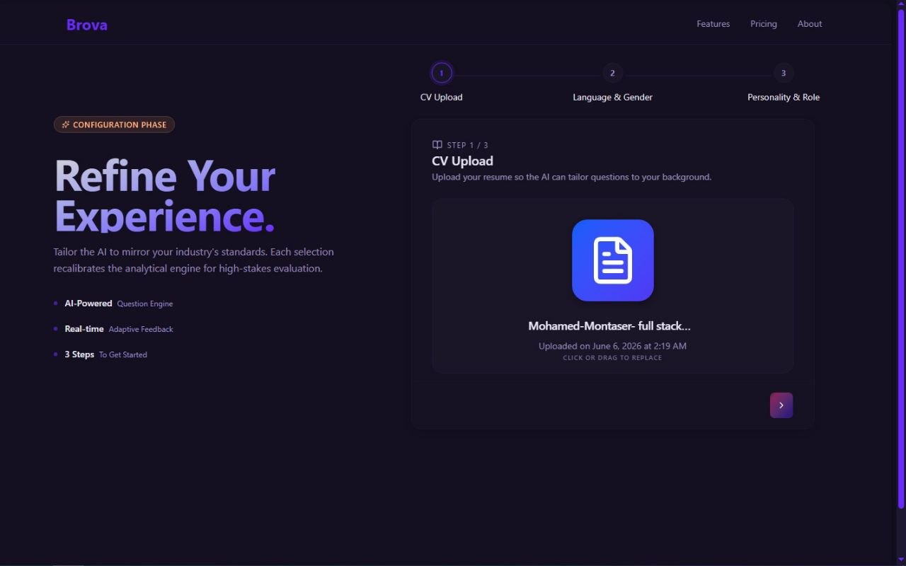
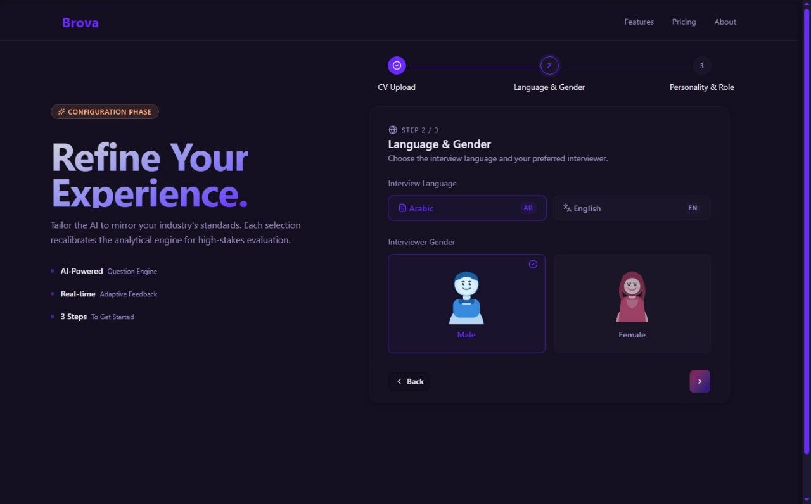
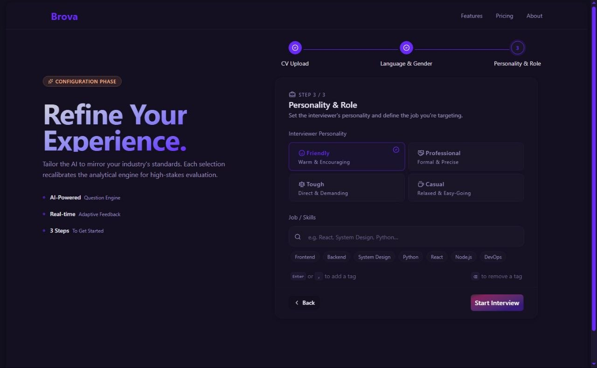
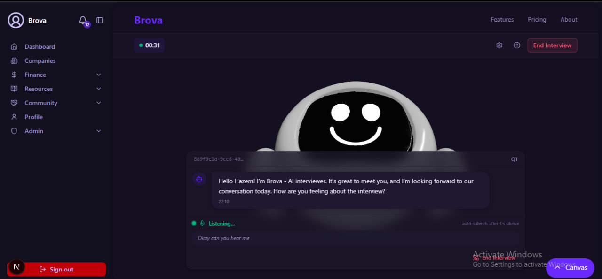
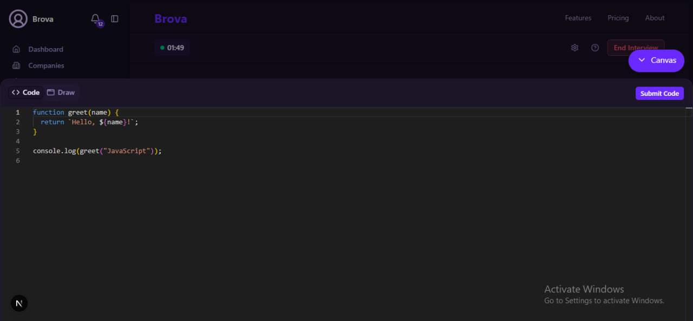
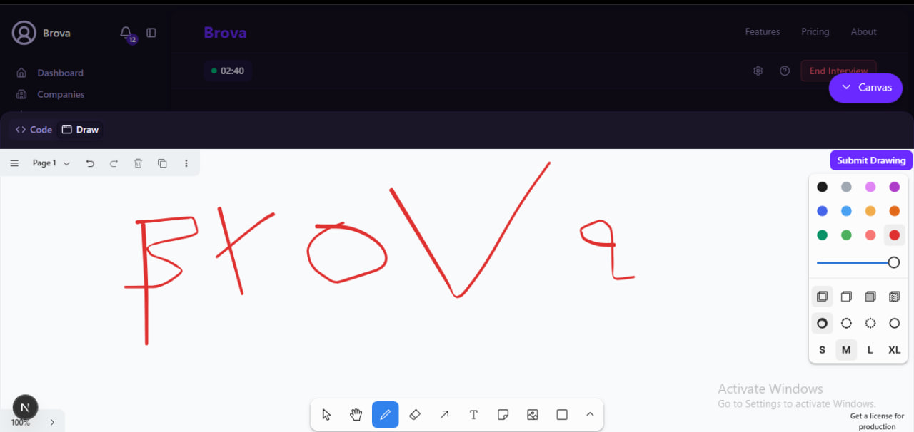

# 🎙️ Brova — AI-Powered Interview Preparation Platform

> Practice smarter. Get hired faster.

Brova is a full-stack AI interview simulation platform that gives candidates a realistic, pressure-free environment to prepare for HR, behavioral, and technical interviews. Upload your CV, configure your interviewer, and walk into a live voice-based session with an AI avatar that asks personalized follow-up questions, evaluates your answers in real time, and challenges you with live coding and diagram problems — just like the real thing.

---

## 🚀 Features

### 🤖 AI Avatar Interviews
Brova conducts realistic, conversational interview sessions powered by large language models. The AI asks context-aware follow-up questions across HR, behavioral, and technical formats — adapting dynamically to your answers, just like a real interviewer would.

### 📄 CV-Based Personalization
Upload your resume and target job description before the session. Brova's AI parses your background and generates questions specifically tailored to your experience, skills, and the role you're applying for — no generic question banks.

### 🎤 Voice Interaction
Interviews are fully hands-free. Speak your answers naturally; the platform transcribes your speech in real time using STT and responds through ElevenLabs' natural-sounding avatar voice. The experience mirrors a real video interview.

### 💻 Live Coding Environment
Technical interviews include a full in-browser IDE with syntax highlighting, multiple language support, and real-time code execution powered by Judge0. Submit your solution and get instant pass/fail feedback on test cases — all without leaving the interview session.

### 🎨 AI Drawing Canvas
For system design and architecture questions, candidates sketch their solutions directly on a tldraw canvas. The AI analyses the submitted diagram as an image and provides intelligent, context-aware feedback — turning whiteboard-style questions into a first-class experience.

### 📊 Performance Reports
After every session, Brova generates a detailed performance report evaluating your clarity, response timing, confidence, and technical accuracy. Track your progress over time through a personal dashboard with session history and analytics.

---

## 🖼️ Screenshots

### Step 1 — CV Upload
Upload your resume so the AI can tailor every question to your background.

---

### Step 2 — Language & Interviewer
Choose your interview language (Arabic / English) and pick your preferred interviewer persona.

---

### Step 3 — Personality & Role
Set the interviewer's style — Friendly, Professional, Tough, or Casual — and define the skills and job role you're targeting.

---

### Live AI Interview Session
Talk with the AI avatar in real time. Voice input is transcribed automatically and the avatar responds naturally with follow-up questions.

---

### Live Coding Canvas
Solve coding challenges inside the session with a full in-browser IDE and real-time execution.

---

### Drawing Canvas
Sketch system architecture or diagrams and have the AI analyse and evaluate them instantly.

---

## 🧠 AI Stack

| Component | Technology |
|---|---|
| **LLM & Question Generation** | OpenAI API + LangChain (Python) |
| **Speech-to-Text (STT)** | ElevenLabs |
| **Text-to-Speech (TTS)** | ElevenLabs |
| **CV Parsing & RAG Pipeline** | LangChain + Azure Blob Storage |
| **Code Execution** | Judge0 |
| **Drawing & Diagram Analysis** | tldraw + OpenAI Vision API |

---

## 🛠️ Full Tech Stack

| Layer | Technologies |
|---|---|
| **Frontend** | Next.js, React, TailwindCSS, tldraw |
| **Backend** | ASP.NET Core (C#), JWT Auth, REST API, WebSocket |
| **AI / ML** | Python, LangChain, OpenAI API, ElevenLabs |
| **Storage** | SQL Database, Azure Blob Storage |
